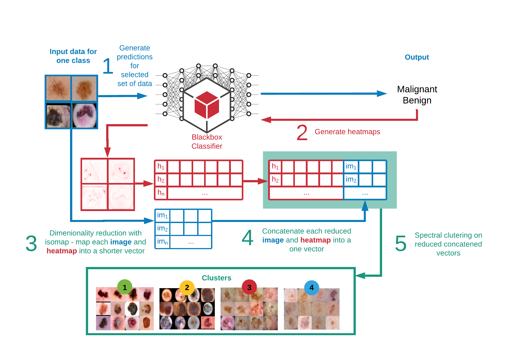
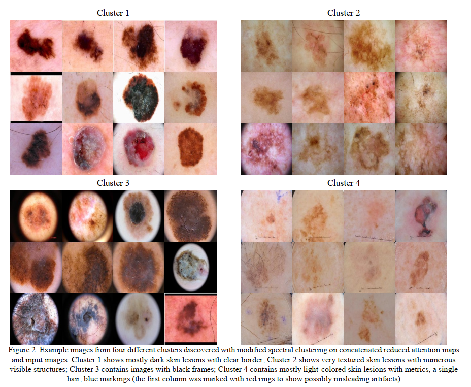
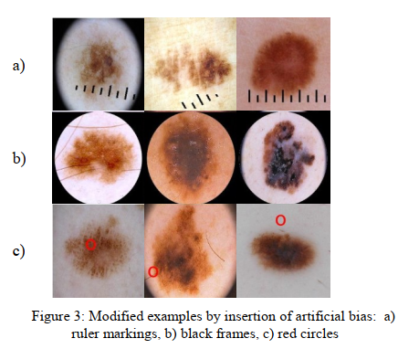
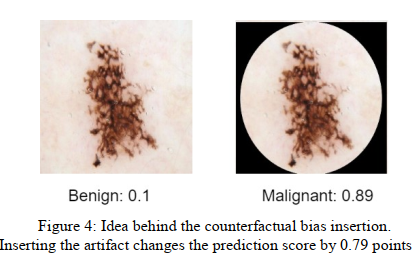
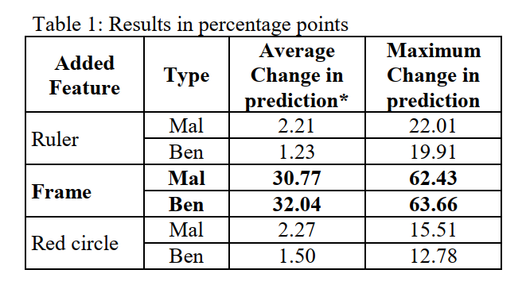

# GEBI
 Global Explanations for Bias Identification

###  Global explanations for discovering bias in data

Agnieszka Mikołajczyk, Michał Grochowski, Arkadiusz Kwasigroch [[paper]](https://arxiv.org/abs/2005.02269)

**Abstarct**:
In the paper, we propose attention-based summarized
post-hoc explanations for detection and identification of
bias in data. We propose a global explanation and
introduce a step-by-step framework on how to detect and
test bias. Then, the bias is evaluated with proposed
counterfactual approach to bias insertion. Because
removing the unwanted bias is often a complicated and
tremendous task, we automatically insert it, instead. We
validate our results on the example of the skin lesion
dataset. Using the method, we successfully identified and
confirmed part of the possible bias-causing artifacts in
dermoscopy images. We confirmed that the commonplace
black frames in the training dataset images have a strong
influence on the Convolutional Neural Network’s
prediction. After artificially adding a black frame to all
images, around 22% of them changed the prediction from
benign to malignant. We have shown that bias detection is
an important step of making more robust models, and we
discuss how to improve them

## Simple framework

Three steps for explainability:
* Discover bias with global explanations [ [code] ](notebooks/GEBI.ipynb)
* Insert bias to all images in the dataset [ [code] ](notebooks/add_bias_to_images-ruler.ipynb)
* Check how predictions changed

## How to detect bias?

* Step 0. Select samples for analysis.

* Step 1. Compute attention maps for the samples of one
class.

* Step 2. Normalize and preprocess both input samples
and accompanying attention maps in the same manner.

* Step 3. Reduce the dimension of each input sample and
relevance map with dimension reduction algorithm, for
instance, with Isomap

* Step 4. Concatenate each reduced sample with a relevant
reduced attention map.

* Step 5. Perform spectral clustering on reduced vectors.

* Step 6. Visualize and analyze obtained clusters.

* Step 7. Formulate and test the hypothesis with bias
insertion algorithm

### Bias in skin lesion dataset

With our proposed method, we have identified four
different clusters. Each cluster reveals unique
characteristics in the look of analyzed data set, related with
the skin tone, skin lesions, but also with the presence of the
unwanted artifacts. The first and the second cluster seem to
group images based on the skin lesions similarity, which is a
welcomed result in this case. 
On the contrary, the third cluster mostly gathers images
with round or rectangular black frames. The last, fourth
cluster contains mostly light skin lesions, very often with a
visible ruler. The proposed method is semi-automated, so a
field expert should analyze the clusters. In this case, we
focused our attention on clusters 3 and 4, where some
additional artifacts grouped those images. Hence, we could
formulate a hypothesis that black frames and ruler marks
might cause possible bias in models. To check if those
features have a significant influence on the prediction, we
conducted another experiment: inserting possible bias and
testing its influence.

### Bias insertion

To test how the prediction will change if feature on the
image is present, we propose to compare models outputs for
the same image with and without the given feature. Because
removing artifacts from the images is very complicated task,
we have decided to insert it, instead. We wanted to mimic
the real artifacts that we found in the dataset, as well as to
add a new one for comparison.

* **Black frames** were added in the same way to all images,
without any variations in size and position. Frames can be
commonly found in numerous images, and are often
recognized as unwanted artifacts

* **Rule marks** were prepared beforehand and placed on the
image in slightly different sizes, angles, and positions.
Rulers are usually used by a doctor to show the size of a skin
lesion on the dermoscopic image.

* **Red circles** cannot be naturally found in the ISIC
archive, SD-198, and Derm7pt datasets. For a clear
comparison, we have also placed those markings. The single
red circle was placed randomly in the image, both within the
skin and lesion areas.

### Measuring bias influence

After we modified the dataset by placing in images
selected artifacts, we began testing our hypothesis by asking
a question: *Are those artifacts causing bias in model’s
performance?* To answer this question we measured how
predictions will change depending on the presence of the
artifacts. In our case, we checked what will happen if we add
to all images: black frames, black rural, and red circles.

### Results

### Codes

Codes can be found in notebook directory. Images used for experiments are provided in the data directory. Images are already preprocessed with Attention Map Generation method.
